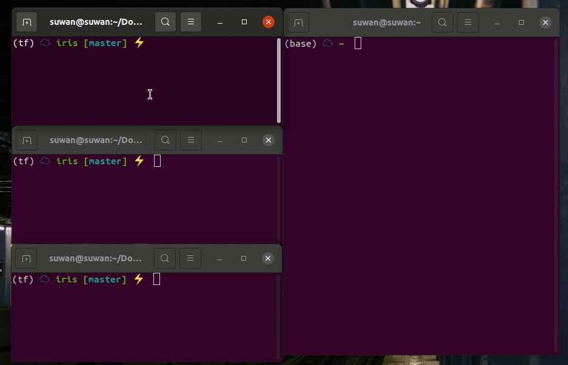

# Iris  Serving

- Flask
- FastAPI
- BentoML


**Train**

```bash
python train.py
```

After doing this, a model file will be created `models/iris.pkl`


**Flask**

```bash
python flask_serving.py # port 5000
```


**FastAPI**

```bash
python fastapi_serving.py # port 5001
```


**BentoML**

```bash
python bentoml_serving.py
# After doing this, a Prediction Service will be created `~/bentoml/repository/IrisClassifier/`

bentoml serve IrisClassifier:latest --port=5002 # port 5002
```


**Test**

```bash
curl 'localhost:5000/prediction' -X POST -H 'Content-Type: application/json' -d '{"sepal_l": 5, "sepal_w": 2, "petal_l": 3, "petal_w": 4}' # Flask
curl 'localhost:5001/prediction' -X POST -H 'Content-Type: application/json' -d '{"sepal_l": 5, "sepal_w": 2, "petal_l": 3, "petal_w": 4}' # fastAPI
curl 'localhost:5002/prediction' -X POST -H 'Content-Type: application/json' -d '{"sepal_l": 5, "sepal_w": 2, "petal_l": 3, "petal_w": 4}' # BentoML
```


**Demo Video**

