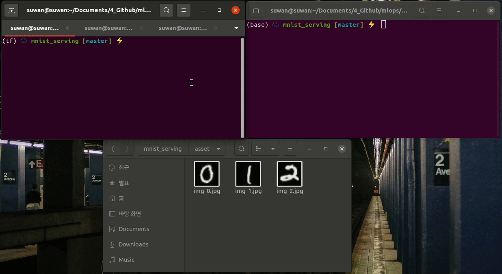

# MNIST CNN Serving

- Flask
- FastAPI
- BentoML


**Train**

```bash
python train.py
```

After doing this, a model file will be created `models/mnist_cnn.ckpt`


**Flask**

```bash
python flask_serving.py # port 5000
```


**FastAPI**

```bash
python fastapi_serving.py # port 5001
```


**BentoML**

```bash
python bentoml_serving.py

bentoml serve MnistTensorflow:latest --port=5002 # port 5002
```


**Test**

```bash
curl -F "file=@asset/img_0.jpg" localhost:5000/prediction
curl -F "file=@asset/img_0.jpg" localhost:5001/prediction
curl -F "file=@asset/img_0.jpg" localhost:5002/prediction
```


**Demo Video**

