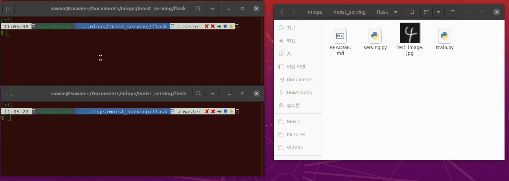

### MNIST 데이터셋으로 학습한 모델 Flask Serving

**Steps**

1. Train
2. Serving (flask - single image)

3. Test

```bash
python train.py
```

```bash
python serving.py
```

```bash
curl -F "image=@<image_path>" localhost:5000/predict
# curl -F "image=@./test_image.jpg" localhost:5000/predict

# return {"result":4}
```


**Demo**



